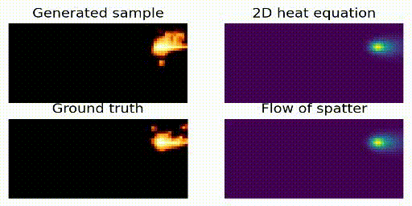

# MGDM

This repository contains the official implementation of the paper:  
**Diffusion-Based Surrogate Modeling and Multi-Fidelity Calibration**

---

## 🎥 Generated Videos

### Fluid Dynamics


### Laser-Based Metal Additive Manufacturing (LBMAM) Process


You can also generate the videos locally. 

First, the zipped pretrained models should be unzipped by running
```bash
unzip models/*.zip
```
Then, the video frames are generated by running:
```bash
python make_heat_video.py
```

---

## 📦 Dataset

The `fluid_data_gen` folder contains simulation code based on [fluidsim](https://pypi.org/project/fluidsim/).

To download pre-generated and preprocessed datasets from Zenodo, run:
```bash
bash download_fluid_dataset.sh
```

---

## 🧠 Training

To train the diffusion-based denoising U-Net models, simply run:
```bash
python diffusion_fluid.py
```
The model checkpoints will be automatically saved under the /models folder.

## 📁 File Organization
- ./fluid_data_gen folder contains another repository that generates fluid simulations.
- ./generated_video saves two sample videos rendered on the website.
- ./models contains model weights of deep denoising neural networks. 
- ./playground contains the implementation that solves 2D heat equation and estimates parameters by mse.
- ./videosamples contains video frames generated by DBS.


- diffusion_fluid.py implements DBS training and sampling on the fluid dataset.
- diffusion_heat.py implements DBS training and sampling on the LBMAM dataset.