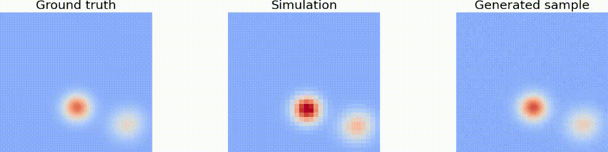
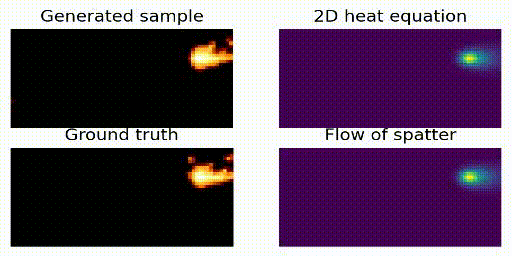

# MGDM

This repository contains the official implementation of the paper:  
**Diffusion-Based Surrogate Modeling and Multi-Fidelity Calibration**

---

## 🎥 Generated Videos

### Fluid Dynamics


### Laser-Based Metal Additive Manufacturing (LBMAM) Process


You can also generate the videos locally by running:
```bash
python make_heat_video.py
```

---

## 📦 Dataset

The `fluid_data_gen` folder contains simulation code based on [fluidsim](https://pypi.org/project/fluidsim/).

To download pre-generated and preprocessed datasets from Zenodo, run:
```bash
bash download_fluid_dataset.sh
```

---

## 🧠 Training

To train the diffusion-based denoising U-Net models, simply run:
```bash
python train.py
```

